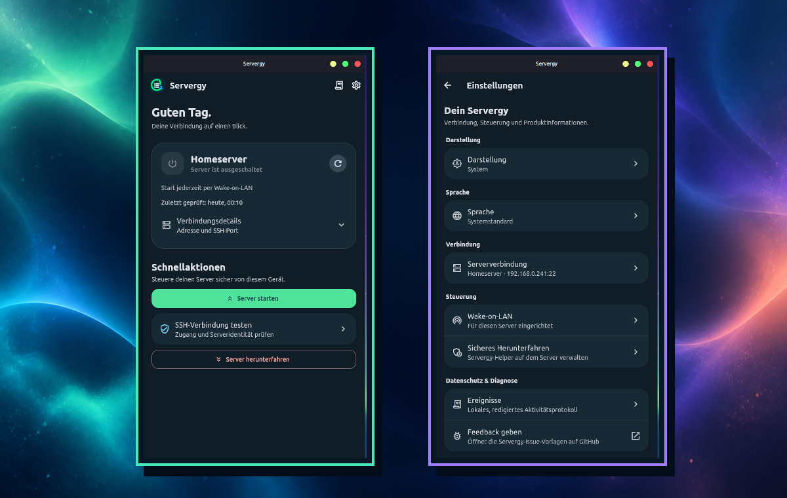

<p align="center">
  
</p>

<h1 align="center">Servergy</h1>

<p align="center">
  <strong>Your home server. Securely reachable. Easy to control.</strong><br />
  A local Flutter app for Wake-on-LAN and controlled SSH power management.
</p>

## 🎯 For existing Debian home servers

Servergy is a **mobile-first companion** for an already configured home server
running Debian or a Debian-based system such as Ubuntu. It neither replaces the
operating system nor acts as a full server control panel, and it never executes
arbitrary remote commands.

Instead, it provides the few tools that matter for a home server used from time
to time: start it conveniently when Wake-on-LAN is available, verify it
securely over SSH, and shut it down in a controlled way after use. This keeps a
home server practical without requiring it to run all the time or be managed
through a complex administration interface.

## 🔍 How Servergy works

| Action | What happens technically | Your control |
| --- | --- | --- |
| **Start the server** | Servergy sends a Wake-on-LAN magic packet on the current home network. A powered-off server does not execute a command. | It works only when BIOS/UEFI, network adapter, and operating system support Wake-on-LAN. The app never configures those prerequisites silently. |
| **Check the connection** | The app connects over SSH and asks you to consciously confirm the host-key fingerprint on first contact. | Passwords, keys, and confirmed host keys remain in your device’s secure storage. A changed host key blocks further actions. |
| **Shut down the server** | After optional one-time preparation, the app calls only `sudo -n /usr/local/sbin/servergy-poweroff`. This argument-free helper starts just the fixed systemd shutdown unit. | There is no remote terminal, no arbitrary shell command, and no general-purpose `sudo` permission. |

### What optional server preparation installs

Using **Settings → Safe shutdown → Prepare server**, the app can configure
exactly these three files on a Debian/Ubuntu server with systemd:

| Server file | Permissions | Purpose |
| --- | --- | --- |
| `/usr/local/sbin/servergy-poweroff` | `root:root` · `0755` | Argument-free helper; starts only the Servergy systemd unit. |
| `/etc/systemd/system/servergy-poweroff.service` | `root:root` · `0644` | Oneshot unit that runs `systemctl poweroff --no-block`. |
| `/etc/sudoers.d/servergy` | `root:root` · `0440` | Lets the chosen SSH user call only the helper — not `shutdown`, a shell, or any other command. |

For this one-time preparation, Servergy asks for the sudo password only over
the already verified SSH connection; it is neither stored nor embedded in a
command. The app verifies the fixed helper contents before transfer and checks
the sudoers file with `visudo` before placing it below `/etc/sudoers.d/`.

If you prefer to inspect or set up these files yourself, the [complete server
guide](docs/server-setup.en.md) includes their exact contents, ownership and
permissions, verification commands, and safe removal.

<p align="center">
  <a href="README.md">🇩🇪 Deutsch</a> ·
  <strong>🇬🇧 English</strong>
</p>

<p align="center">
  <a href="https://github.com/Web-Developer-DB/Servergy/actions/workflows/quality.yml">
    
  </a>
  <a href="docs/release-readiness.md">
    
  </a>
  <a href="https://github.com/Web-Developer-DB/Servergy/releases">
    
  </a>
  <a href="docs/privacy.en.md">
    
  </a>
  <a href="LICENSE">
    
  </a>
</p>

<p align="center">
  <a href="#-for-existing-debian-home-servers">Who it is for</a> ·
  <a href="#-how-servergy-works">How it works</a> ·
  <a href="#-overview">Overview</a> ·
  <a href="#-the-app-at-a-glance">See the app</a> ·
  <a href="#-getting-started">Getting started</a> ·
  <a href="#-security-by-default">Security</a> ·
  <a href="#-quality-and-release">Quality &amp; release</a> ·
  <a href="#-documentation">Documentation</a>
</p>

> [!NOTE]
> **Servergy is under active development; a GitHub release is not available
> yet.** The app is intended for your own home server. Before the first
> publication, complete the real-device tests, signatures, and release criteria
> documented in [docs/release-readiness.md](docs/release-readiness.md).

## 📱 The app at a glance

<p align="center">
  
</p>

<p align="center">
  <em>Dashboard and settings: compact, clear, and consistent on Android, Linux, and Windows.</em>
</p>

## ✨ Overview

|  | What Servergy means |
| --- | --- |
| 🏠 **A clear focus** | A local app for **one** home server — no cloud account and no complicated server administration. |
| 🔐 **Secure control** | SSH access, host-key verification, and a narrow, fixed shutdown helper instead of arbitrary shell commands. |
| ⚡ **Start again** | Wake-on-LAN with a status check when your server is switched off. |
| 🧭 **Guided setup** | A focused assistant walks you through network, server, SSH, connection verification, and optional Wake-on-LAN. |
| 🕶️ **Stay private** | No cloud, telemetry, tracking, or background service. All data stays on your device. |

Servergy only performs actions that you explicitly trigger. The app stays in
the foreground and connects only to the home server you configure.

## 🧩 Features

| Area | What Servergy does | Your benefit |
| --- | --- | --- |
| 🔎 **Find a server** | Optionally searches mDNS announcements and briefly checks possible SSH targets on the local IPv4 network; a host or IP can always be entered manually. | A faster start on a home network while keeping full control for VPNs or fixed addresses. |
| 🔑 **SSH access** | Supports password authentication as well as OpenSSH, RSA, and EC keys; encrypted keys request their passphrase only for the current action. | Credentials are not unnecessarily entered or displayed again. |
| 🪪 **Host-key protection** | The SHA-256 fingerprint is consciously confirmed on first contact. A changed key blocks further actions. | Protection against a target being replaced accidentally or maliciously. |
| ⚡ **Wake-on-LAN** | Sends Wake-on-LAN and then checks whether the SSH port becomes reachable again. | A switched-off server can be started conveniently. |
| ⏻ **Safe shutdown** | Uses a restricted, root-owned Servergy helper with a fixed systemd unit. | No general-purpose `sudo` and no freely chosen remote commands. |
| 🧾 **Events** | Keeps a bounded, local, redacted activity log. | Useful diagnostics without profile or network data in the export. |
| 🎨 **Platform-ready** | System default plus light or dark Material 3 appearance, large interaction targets, and native launcher and start-menu icons. | A calm, understandable experience on Android, Linux, and Windows. |
| 🌐 **Bilingual** | System default, Deutsch, or English; German system languages select German and all others select English. | Change the language any time directly in Settings. |

### 🌐 Language

Servergy supports German and English. The default **System default** follows
your operating system: `de`, `de-DE`, `de-AT`, and other German variants open
the app in German; every other system language automatically opens it in
English. In **Settings → Language**, choose **Deutsch** or **English**
permanently, or return to the system default. The selection applies instantly
throughout the app and remains after restart.

### 🎨 Brand and app icons

The Servergy symbol combines the home server with its two clear actions: green
means starting or reachable, while blue means a safe shutdown. The wordmark is
used for GitHub, the website, and window titles; launchers use the square icon
without text.

| Platform | Delivered as | Variants |
| --- | --- | --- |
| 🤖 Android | Adaptive launcher resource | Full color, foreground, and monochrome for modern launchers |
| 🪟 Windows | `app_icon.ico` | Multi-size icon up to 256 px for windows and the Start menu |
| 🐧 Ubuntu/Linux | Hicolor theme | PNGs from 16 to 512 px plus a scalable SVG |

All variants are reproducibly generated from the approved source with
[`tool/generate_launcher_icons.dart`](tool/generate_launcher_icons.dart).

## 🗺️ How it works

| Step | In the app | Security decision |
| :---: | --- | --- |
| `1` | 🌐 **Understand the network boundary** | Servergy explains when a home network or VPN is appropriate. |
| `2` | 🔎 **Find or enter the server** | A discovery result is only a candidate — not yet a trusted server. |
| `3` | 🔑 **Choose SSH access** | Keys are preferred; passwords remain in the operating system’s secure storage. |
| `4` | 🪪 **Verify connection and host key** | New credentials are stored only after a successful SSH test. |
| `5` | ⚡ **Add Wake-on-LAN** | MAC and broadcast data can be checked, saved, or added later. |

After setup, the home screen becomes a dashboard: reachability, the last check,
and the appropriate next action are prominent; technical details remain
available in Events and Settings.

## 🚀 Getting started

### For users

The first download will be published only after release sign-off. Afterwards,
release artifacts will be published as signed GitHub releases with SHA-256
checksums. Always read the release notes and verify the checksum before
installing an artifact.

| Platform | Release artifact | Start |
| --- | --- | --- |
| 🤖 **Android 12+** | Signed APK | Install the APK from the GitHub release and consciously grant local-network access if requested. |
| 🐧 **Linux** | User bundle (`.tar.gz`) | Extract the archive, run `./install-linux.sh`, then start Servergy from the application menu. The installation stays under `~/.local/share/servergy`. |
| 🪟 **Windows 11** | Signed ZIP | Extract the ZIP, verify the Windows signature, and start `servergy.exe`. |

> [!NOTE]
> A real Wake-on-LAN test requires a suitable home network. Android emulators
> and VPN connections do not replace a broadcast test on the local network.

### For your home server

1. Enable Wake-on-LAN in the BIOS/UEFI, operating system, and — if required —
   your network equipment.
2. Create a dedicated SSH user and use a private key whenever possible.
3. Compare the host-key fingerprint directly on the server before confirming
   it in the app.
4. Set up the restricted shutdown helper through **Settings → Safe shutdown →
   Prepare server** or by following the guide.

The complete, secure Debian/Ubuntu setup with systemd is documented in
[docs/server-setup.md](docs/server-setup.md).

<details>
<summary><strong>Start development locally</strong></summary>

<br />

**Prerequisites**

- Flutter/Dart matching `pubspec.yaml`
- Android Studio/JDK for Android builds
- on Linux: `clang`, `cmake`, `ninja-build`, `pkg-config`, `libgtk-3-dev`,
  `libsecret-1-dev`, and `libsecret-1-0`
- an Android device/emulator, Linux desktop, or Windows development machine

```bash
flutter pub get
flutter analyze
flutter test
flutter run
```

**Platform builds**

```bash
flutter build apk --debug
flutter build linux --debug
flutter build windows --debug
```

The complete development, emulator, and real-device guide is available in
[docs/development.md](docs/development.md).

</details>

## 🛡️ Security by default

Servergy is designed to be convenient while deliberately keeping home-server
access narrow.

| Protection | How Servergy implements it |
| --- | --- |
| **No cloud** | Servergy does not send profile, diagnostic, or usage data to a backend service. |
| **Separate data stores** | Non-secret profile data is kept in app preferences; passwords, private keys, and confirmed host keys are kept in the operating system’s secure storage. |
| **No password fallback** | Switching to key authentication removes a stored password. An empty password field deliberately means “keep the existing value”. |
| **Fingerprints instead of names** | Trust is tied to host and port. A changed key must be checked outside the app. |
| **No remote terminal** | The app provides no input for arbitrary remote commands. |
| **Narrow shutdown path** | The app calls only `sudo -n /usr/local/sbin/servergy-poweroff`. The helper starts only the fixed systemd unit. |
| **Redacted diagnostics** | The export contains time, action, result, error code, and duration — never passwords, keys, usernames, complete host addresses, or MAC addresses. |

### The shutdown helper at a glance

The optional server setup manages only these files:

| Server file | Owner & permissions | Purpose |
| --- | --- | --- |
| `/usr/local/sbin/servergy-poweroff` | `root:root` · `0755` | Argument-free helper; confirms the request and starts only the Servergy systemd unit. |
| `/etc/systemd/system/servergy-poweroff.service` | `root:root` · `0644` | Oneshot unit that shuts the server down only after a successful SSH response. |
| `/etc/sudoers.d/servergy` | `root:root` · `0440` | Allows the configured SSH user to call only this one helper. |

The exact steps, permission checks, manual fallback, and safe removal are
described in the [server guide](docs/server-setup.md).

## ⚠️ Deliberate limitations

| Topic | What you should know |
| --- | --- |
| 🏠 **One server** | Version 1 deliberately manages only one home server. |
| 🌙 **Powered-off devices** | A powered-off server cannot be discovered; starting it requires correctly configured Wake-on-LAN beforehand. |
| 📡 **Network discovery** | Discovery finds SSH candidates on the current local network, but not reliable MAC addresses or general VPN targets. |
| 🔌 **Wake-on-LAN** | Broadcasts over VPN are unreliable and are not configured by Servergy. A wired network adapter is the robust choice. |
| 🐧 **Shutdown helper** | The documented convenient setup path requires Debian/Ubuntu with systemd. |
| 📱 **Android 17** | Local network actions require the permission requested by the system; without it, manual VPN configuration remains possible. |

## 🧪 Quality and release

The stable release clearly separates automatable checks from the tests that
must be completed on real hardware and in a real home network.

| Check | Automated | Additionally required before release |
| --- | :---: | --- |
| Formatting, static analysis, and tests | ✅ | — |
| Android, Linux, and Windows debug builds | ✅ | Visual review on target devices |
| Icon consistency and Linux user installer | ✅ | Start-menu, uninstall, and storage checks on Linux |
| Android and Windows signing | ✅ in tag workflow | Production signing secrets configured in GitHub |
| WOL, SSH, shutdown, and VPN | — | ✅ Document with a real home server |
| Privacy and diagnostic export | Partly | ✅ Review the export before sending it |

The binding test matrix and release decision are in
[docs/release-readiness.md](docs/release-readiness.md). The former
[Beta documentation](docs/beta.md) remains available as an archive.

## 💬 Feedback and bug reports

Feedback is especially useful for real network, router, VPN, and Wake-on-LAN
configurations. In the app, **Settings → Give feedback** opens the GitHub issue
templates directly.

| Report | Template | Please do not submit |
| --- | --- | --- |
| 🐛 Reproducible bug | [Report a bug](https://github.com/Web-Developer-DB/Servergy/issues/new?template=bug_report.yml) | Passwords, private keys, complete IP addresses, MAC addresses, or unredacted screenshots |
| 💡 Usability issue or idea | [Give feedback](https://github.com/Web-Developer-DB/Servergy/issues/new?template=feedback.yml) | Credentials or diagnostic content that you have not intentionally reviewed |

A diagnostic export is optional and already redacted. Review it once more
before uploading it.

## 📚 Documentation

| Document | Contents |
| --- | --- |
| [Release readiness](docs/release-readiness.md) | Real-device test matrix, signatures, release gates, and feedback rules |
| [Server guide](docs/server-setup.en.md) | Wake-on-LAN, SSH user, restricted sudoers helper, and manual fallback |
| [Architecture](docs/architecture.md) | Data flow, components, boundaries, and security decisions |
| [Development & tests](docs/development.md) | Local development environment, builds, quality checks, and real-device tests |
| [Privacy](docs/privacy.en.md) | Local data processing and redacted diagnostic exports |
| [Release checklist](docs/release-checklist.md) | Final checks before a stable or explicitly pre-release build |

## 🤝 Contributing

`main` is the shared integration and release branch. Create a short-lived topic
branch for each change, keep it current with `main`, then open a pull request
into `main`.

Before opening a pull request:

```bash
dart format lib test tool
flutter analyze
flutter test
dart run tool/generate_launcher_icons.dart
```

New network or SSH features always need tests plus deliberate checks of error
paths, cancellations, and real devices. Credentials, private keys, personal
network data, and real diagnostics never belong in commits, tests, or
screenshots.

## 📄 License

Servergy is released under the [MIT License](LICENSE).

---

<p align="center">
  Built for a calmer, safer home server routine. 🏠
</p>
